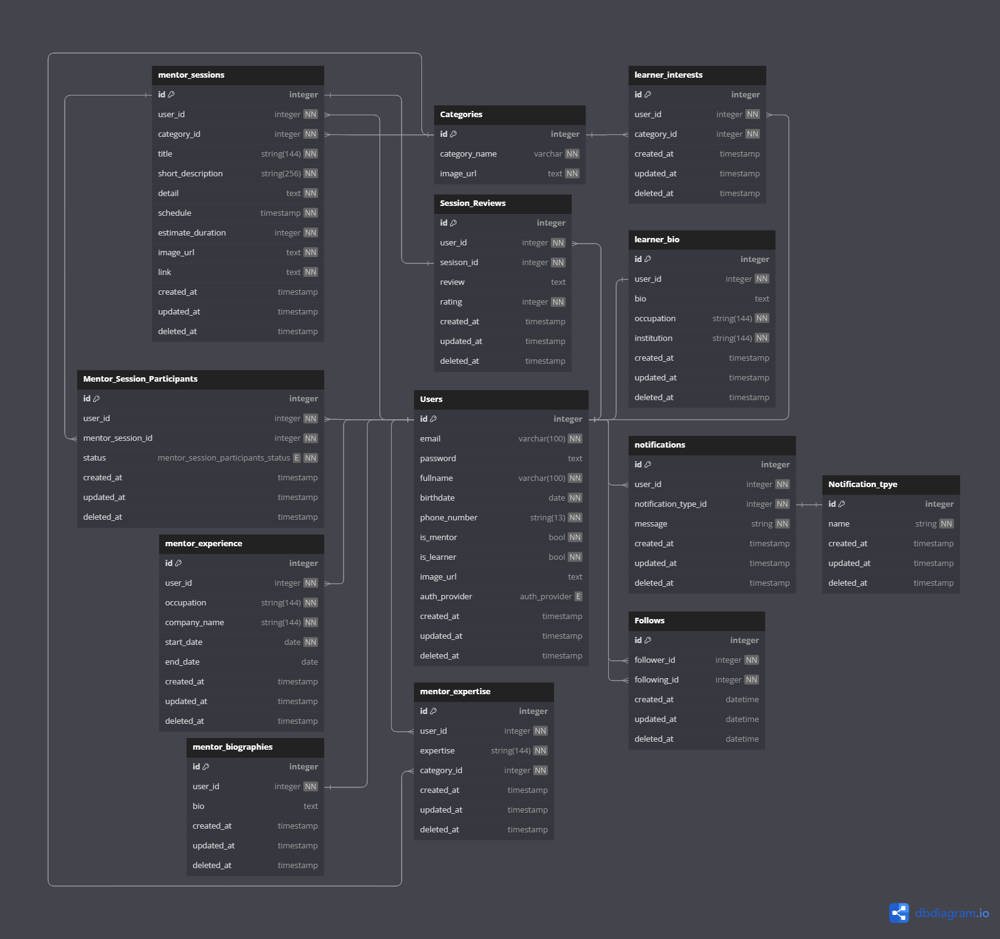

# Pijar Backend

Pijar is a community-focused learning platform designed to empower underserved communities through accessible education and skill development. By connecting learners with experienced mentors, Pijar provides personalized sessions, localized topics in Bahasa Indonesia and practical skills like farming, entrepreneurship and digital literacy.

-   [Overview](#overview)
-   [ERD](#erd)
-   [Prerequisites](#prerequisites)
-   [Environment Variables](#environtment-variables)
-   [Build the Application](#build-the-application)
-   [Start the Application](#start-the-application)
-   [Once the Application is Running](#once-the-application-is-running)
-   [Stopping the Application](#stopping-the-application)
-   [Resetting the Application](#resetting-the-application)
-   [API Documentation](#api-documentation)

## Overview

This repository is a Dockerized Go Project that handle backend process for our website 'Pijar'. This backend is made by using these stack bellow:


## ERD

The Entity Relationship Diagram (ERD) provides an overview of the database structure:



## Prerequisites

Ensure the following are installed on your system:

-   **Docker**
-   **Docker Compose**

## Environtment Variables

Duplicate '.env.template' file and rename it to '.env'. The variables inside that file are already set up for the application.

## Build the Application

Because this application is already use Docker-Compose, you only need to open a new terminal in project's root folder and run this command:

```bash
docker-compose up --build
```

## Start the Application

Run the following command to start the application

```bash
docker-compose up
```

## Once the Application is Running

Once the application is running, visit [http://127.0.0.1:8080/swagger/index.html](http://127.0.0.1:8080/swagger/index.html)

## Stopping the Application

To stop the application gracefully, follow these steps:

1. Press **`CTRL+C`** to stop the process.
2. Run the following command to clean up containers:

```bash
docker-compose down
```

## Resetting the Application

If you encounter errors or need a fresh start, follow these steps:

1. Run the following command to remove all volumes, networks, and containers:

```bash
docker-compose down -v
```

2. Start the application

```bash
docker-compose up
```

## API Documentation

This application has been deployed using an Amazon Web Service EC2 instance. You can visit: [http://43.218.229.167/swagger/index.html](http://43.218.229.167/swagger/index.html). (You might encounter a **`WARNING`** about an insecure connection. This happens because HTTPS is not yet configured. To access the API documentation, click **`Continue To Site`**, and you will be redirected.)

Or if you already run the Backend locally, you can visit : [http://127.0.0.1:8080/swagger/index.html](http://127.0.0.1:8080/swagger/index.html)
